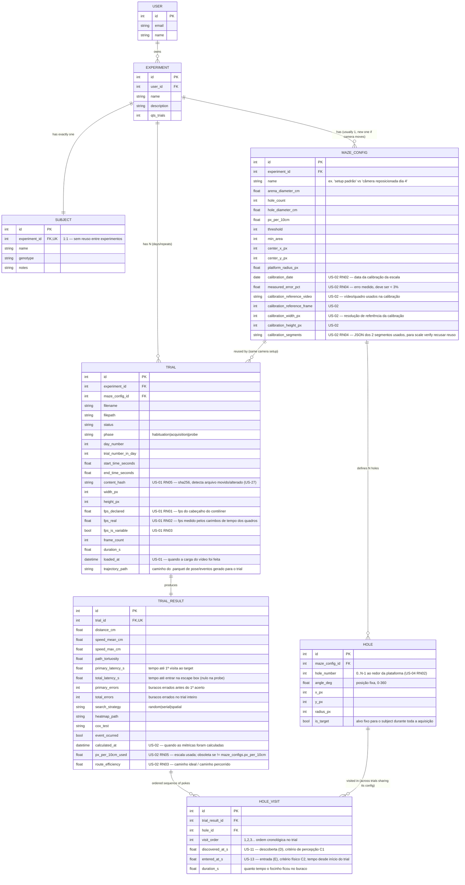

<!--
Pontos identificados na revisão do schema mas propositalmente adiados —
retomar quando os cards correspondentes forem abertos:

- US-27 (proveniência completa das execuções): TRIAL_RESULT ainda não versiona
  qual modelo de pose, qual versão de config (`versao_definicoes` do
  configs/default.yaml) nem qual versão do pipeline gerou o resultado.
  Considerar `pose_model_version`, `config_version`, `processed_at`.
- US-20 (classificação de estratégia): TRIAL_RESULT não tem campo de entropia
  espacial da trajetória, usada como critério ("entropia_max_espacial").
- US-19 (índice de eficiência de rota): resolvido pela US-02 — `path_tortuosity`
  fica para outra métrica; `route_efficiency` (caminho-ideal / caminho-real)
  é campo próprio, adicionado em `0002_us02_calibration.sql`.
- US-21 / US-29 (kappa entre classificação automática e observador humano):
  falta onde guardar o rótulo manual de estratégia para comparar contra o
  `search_strategy` automático.
- US-18 (velocidade por fase): hoje só há `speed_mean_cm`/`speed_max_cm`
  agregados do trial inteiro; falta quebra por fase S→D vs. D→E.
-->

