```mermaid
erDiagram
    USER ||--o{ EXPERIMENT : owns

    EXPERIMENT ||--|| SUBJECT : "has exactly one"
    EXPERIMENT ||--o{ MAZE_CONFIG : "has (usually 1, new one if camera moves)"
    EXPERIMENT ||--o{ TRIAL : "has N (days/repeats)"

    MAZE_CONFIG ||--o{ HOLE : "defines N holes"
    MAZE_CONFIG ||--o{ TRIAL : "reused by (same camera setup)"
    MAZE_CONFIG ||--o{ EXECUCAO : "pose training/evaluation/inference"
    TRIAL |o--o{ EXECUCAO : "optional except inference/processing; same maze_config"

    TRIAL ||--o{ TRIAL_RESULT : "one per processing execution (US-27)"
    EXECUCAO ||--o| TRIAL_RESULT : "produced (NOT NULL, same trial)"
    TRIAL ||--o{ EVENTO_BURACO : "has events"
    EXECUCAO ||--o{ EVENTO_BURACO : "detected (NOT NULL, same trial)"
    HOLE ||--o{ EVENTO_BURACO : "at"
    TRIAL_RESULT ||--o{ HOLE_VISIT : "ordered sequence of pokes"
    HOLE ||--o{ HOLE_VISIT : "visited in (across trials sharing its config)"

    USER {
        int id PK
        string email
        string name
    }
    EXPERIMENT {
        int id PK
        int user_id FK
        string name
        string description
        int qts_trials
    }
    SUBJECT {
        int id PK
        int experiment_id FK, UK "1:1 — sem reuso entre experimentos"
        string name
        string genotype
        string notes
    }
    MAZE_CONFIG {
        int id PK
        int experiment_id FK
        string name "ex. 'setup padrão' vs 'câmera reposicionada dia 4'"
        float arena_diameter_cm
        int hole_count
        float hole_diameter_cm
        float px_per_10cm
        int threshold
        int min_area
        float center_x_px "float desde a 0005 (era int)"
        float center_y_px
        float platform_radius_px
        date calibration_date "US-02 RN02 — data da calibração da escala"
        float measured_error_pct "US-02 RN04 — erro medido, deve ser < 3%"
        string calibration_reference_video "US-02 — vídeo/quadro usados na calibração"
        int calibration_reference_frame "US-02"
        int calibration_width_px "US-02 — resolução de referência da calibração"
        int calibration_height_px "US-02"
        string calibration_segments "US-02 RN04 — JSON dos 2 segmentos usados, para scale verify recusar reuso"
    }
    HOLE {
        int id PK
        int maze_config_id FK
        int hole_number "0..N-1 ao redor da plataforma (US-04 RN02); 0 = buraco físico de referência (US-05)"
        float angle_deg "posição fixa, 0-360"
        float x_px "float desde a 0005 (era int)"
        float y_px
        float radius_px "US-04 RN06 — base das zonas de proximidade; ajustado na janela de maze create"
        bool is_target "alvo fixo para o subject durante toda a aquisição"
    }
    TRIAL {
        int id PK
        int experiment_id FK
        int maze_config_id FK
        string filename
        string filepath
        string status
        string phase "habituation|acquisition|probe"
        int day_number
        int trial_number_in_day
        float start_time_seconds "US-03 RN01/RN04 — início do intervalo útil (null = ainda não recortado)"
        float end_time_seconds "US-03 RN01/RN04 — fim do intervalo útil"
        bool interval_manually_adjusted "US-03 RN03/Cenário 2 — true se veio de ajuste manual, não da detecção automática"
        string content_hash "US-01 RN05 — sha256, detecta arquivo movido/alterado (US-27)"
        int width_px
        int height_px
        float fps_declared "US-01 RN01 — fps do cabeçalho do contêiner"
        float fps_real "US-01 RN02 — fps medido pelos carimbos de tempo dos quadros"
        bool fps_is_variable "US-01 RN03"
        int frame_count
        float duration_s
        datetime loaded_at "US-01 — quando a carga do vídeo foi feita"
        string trajectory_path "caminho do .parquet de pose/eventos gerado para o trial"
        float rotation_deg "US-05 RN01 — rotação da plataforma, 0-360, sem default (NULL = não registrada)"
        float cobertura_pose "US-27/US-10 — fração 0-1 de quadros com pose válida; NULL até a US-10"
        int cobertura_execucao_id FK "US-27 — execução (do mesmo trial) que calculou a cobertura"
        bigint file_size_bytes "US-27 RN04 — checagem barata de arquivo alterado; NULL antes da 0007"
    }
    EXECUCAO {
        int id PK
        string kind "treino|avaliacao|inferencia|processamento (US-27)"
        string model_id "pesos locais em models/; obrigatório exceto em processamento sem pose"
        int maze_config_id FK "treino por montagem, nunca por trial"
        int trial_id FK "obrigatório na inferência e no processamento; nulo no treino"
        string status "concluido|falhou; nova tentativa = nova linha"
        float duration_seconds "finito e >=0; obrigatório na inferência concluída"
        string artifact_path "pesos, relatório ou predições locais"
        json metadata "manifesto: dados, parâmetros, ambiente, máquina, commit, hashes e resultados"
        datetime recorded_at "instante do registro no banco (data da execução)"
        string git_commit "US-27 RN01 — HEAD do código executado; NULL sem git/legado"
        bool git_dirty "US-27 RN05 — alterações não commitadas; NULL = desconhecido"
        json limiares "US-27 RN01 — configs/default.yaml vigente"
        string limiares_sha256 "US-27 — hash dos bytes do arquivo de limiares"
        json parametros "US-27 RN01 — entradas e opções do processamento"
        string video_hash "US-27 RN04 — hash do vídeo verificado nesta execução"
        datetime iniciado_em "US-27 — início do processamento"
    }
    EVENTO_BURACO {
        int id PK
        int trial_id FK
        int hole_id FK
        int execucao_id FK "NOT NULL — FK composta (execucao_id, trial_id)"
        string tipo "descoberta|entrada"
        int quadro ">= 0"
        float t_s "segundos desde o início do intervalo útil (US-03 RN05)"
        float distancia_cm "US-11 — focinho→buraco, opcional"
        float angulo_deg "US-11 — cabeça→buraco, 0-360, opcional"
    }
    TRIAL_RESULT {
        int id PK
        int trial_id FK "não é mais UK desde a 0007: uma linha por execução"
        int execucao_id FK, UK "US-27 RN02 — NOT NULL; métrica órfã é erro de esquema"
        float distance_cm
        float speed_mean_cm
        float speed_max_cm
        float path_tortuosity
        float primary_latency_s "tempo até 1ª visita ao target"
        float total_latency_s "tempo até entrar na escape box (nulo na probe)"
        int primary_errors "buracos errados antes do 1º acerto"
        int total_errors "buracos errados no trial inteiro"
        string search_strategy "random|serial|spatial"
        string heatmap_path
        string cox_test
        bool event_ocurred
        datetime calculated_at "US-02 — quando as métricas foram calculadas"
        float px_per_10cm_used "US-02 RN05 — escala usada; obsoleta se != maze_configs.px_per_10cm"
        float route_efficiency "US-02 RN03 — caminho ideal / caminho percorrido"
    }
    HOLE_VISIT {
        int id PK
        int trial_result_id FK
        int hole_id FK
        int visit_order "1,2,3... ordem cronológica no trial"
        float discovered_at_s "US-11 — descoberta (D), critério de percepção C1"
        float entered_at_s "US-13 — entrada (E), critério físico C2, tempo desde início do trial"
        float duration_s "quanto tempo o focinho ficou no buraco"
    }
```

`execucao` (migração `0006_pose_executions.sql`) registra o identificador do
modelo e o manifesto completo das tentativas de treino, avaliação e inferência
(US-07/US-08). Os binários dos pesos ficam em `models/`, fora do Git. O campo
`metadata` é JSONB e armazena versão/hash do conjunto, hiperparâmetros, ambiente,
máquina, commit do código, início/fim, hashes dos artefatos e resultados.
A FK composta `(trial_id, maze_config_id)` garante que a inferência use a montagem
do trial. Uma execução concluída de inferência exige duração e caminho de saída.
Registros não aceitam UPDATE: repetir ou corrigir uma execução acrescenta outra
linha com outro identificador. `metadata.run_id`, quando informado, é único por
tipo de execução: repetir o registro dos mesmos artefatos devolve o id anterior;
reutilizá-lo com outra proveniência é recusado. A exclusão segue a cadeia de
posse com CASCADE, como as demais tabelas.

## US-27 — proveniência e catálogo (migração `0007_us27_proveniencia.sql`)

O escopo (`definicao-projeto.md`) lista as tabelas `animal`, `montagem`, `sessao`,
`trial`, `evento_buraco`, `metrica` e `execucao`. Os nomes já existentes foram
mantidos — renomear quebraria bancos já em uso — e a correspondência é:

| Escopo | Banco | Observação |
|---|---|---|
| `animal` | `subjects` | 1:1 com o experimento |
| `montagem` | `maze_configs` + `holes` | inclui a escala px→cm da US-02 |
| `sessao` | VIEW `sessao` | derivada de `trials` (animal, `day_number`, `phase`, data do 1º carregamento) |
| `trial` | `trials` | |
| `metrica` | `trial_results` | uma linha por trial, por execução |
| `evento_buraco` | `evento_buraco` | nova na 0007 |
| `execucao` | `execucao` | da 0006, estendida na 0007 |

- **Métrica órfã é erro de esquema (RN02).** `trial_results.execucao_id` e
  `evento_buraco.execucao_id` são `NOT NULL` com FK composta `(execucao_id, trial_id)`
  para `execucao (id, trial_id)`: a execução precisa existir e ser do mesmo trial.
- **Histórico.** Reprocessar acrescenta uma linha em `trial_results` (não há mais
  `UNIQUE(trial_id)`); o resultado "atual" é o mais recente. Resultados anteriores
  continuam ligados às execuções que os produziram.
- **`kind = 'processamento'`** registra limiares, parâmetros, commit, estado sujo,
  hash do vídeo e horário em colunas próprias. Na migração, cada métrica anterior
  à US-27 recebeu uma execução com `metadata.legado = true` (sem commit nem
  limiares), que nunca é tomada como reproduzível.
- **Cobertura de pose (US-10).** `trials.cobertura_pose` + `cobertura_execucao_id`,
  nulos até a US-10. As correções manuais da US-10 devem ir numa tabela própria
  (sugestão: `correcao_pose(id, trial_id, execucao_id NOT NULL, quadro, ...)`, com a
  mesma FK composta), criada pela migração da US-10.
- `trials.status` (da 0001) não é usado: a situação no catálogo é derivada
  (ver `barnes.db.catalog`).

<!--
Pontos identificados na revisão do schema mas propositalmente adiados —
retomar quando os cards correspondentes forem abertos:

- US-20 (classificação de estratégia): TRIAL_RESULT não tem campo de entropia
  espacial da trajetória, usada como critério ("entropia_max_espacial").
- US-19 (índice de eficiência de rota): resolvido pela US-02 — `path_tortuosity`
  fica para outra métrica; `route_efficiency` (caminho-ideal / caminho-real)
  é campo próprio, adicionado em `0002_us02_calibration.sql`.
- US-21 / US-29 (kappa entre classificação automática e observador humano):
  falta onde guardar o rótulo manual de estratégia para comparar contra o
  `search_strategy` automático.
- US-18 (velocidade por fase): hoje só há `speed_mean_cm`/`speed_max_cm`
  agregados do trial inteiro; falta quebra por fase S→D vs. D→E.
-->

